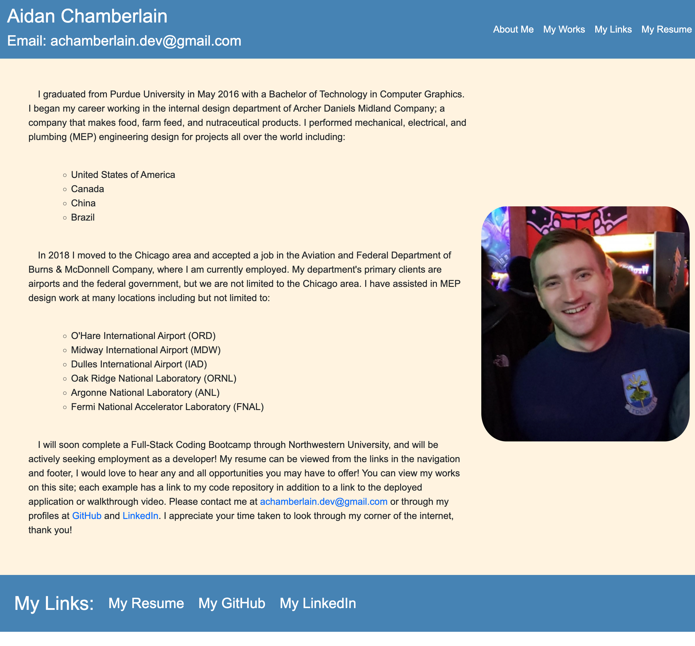

# portfolio-aidan-chamberlain 

## Table of Contents:

-   [Description](./README.md#description)
-   [License](./README.md#license)
-   [Contributing](./README.md#contributing)
-   [Screenshot](./README.md#screenshot)
-   [Links to Application](./README.md#links-to-application)
-   [Questions](./README.md#questions)

## Description

This is my personal portfolio page. I explain about myself and share links to my works, resume, GitHub, and LinkedIn. I am currently hunting for a job as a developer, so please take a moment to look through my portfolio and give some feedback (critical feedback in particular, please!). Thank you for stopping by my little corner of the internet!

## License

This software is licensed to MIT, for more information you may visit this link:
[MIT License Wikipedia](https://en.wikipedia.org/wiki/MIT_License)

## Contributing

If you wish to contribute to my content, please contact me at asunshine99@gmail.com.

## Screenshot

## Links to Application

-   Here is the repo: [https://github.com/RedComet6/portfolio-aidan-chamberlain-v2](https://github.com/RedComet6/portfolio-aidan-chamberlain-v2)
-   Here is the Heroku deployed app: [https://portfolio-aidan-chamberlain.herokuapp.com/](https://portfolio-aidan-chamberlain.herokuapp.com/)

## Questions

If you have any questions, you may contact:

#### Aidan Chamberlain

Email: achamberlain.dev@gmail.com  
Github Profile: [https://www.github.com/RedComet6](https://www.github.com/RedComet6)  
LinkedIn Profile: [https://www.linkedin.com/in/aidan-chamberlain-776b8b90](https://www.linkedin.com/in/aidan-chamberlain-776b8b90)
